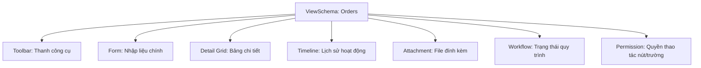
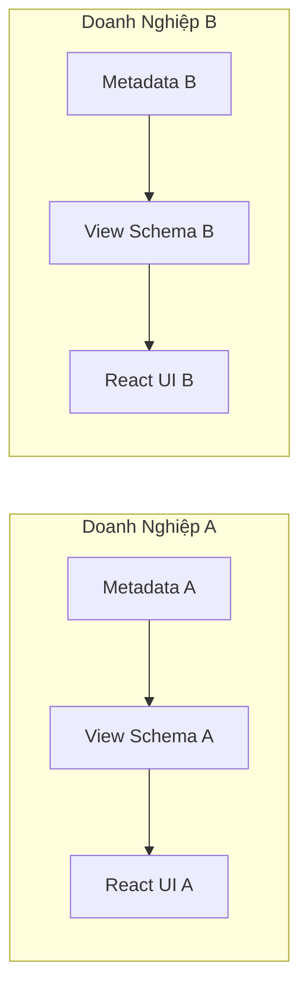
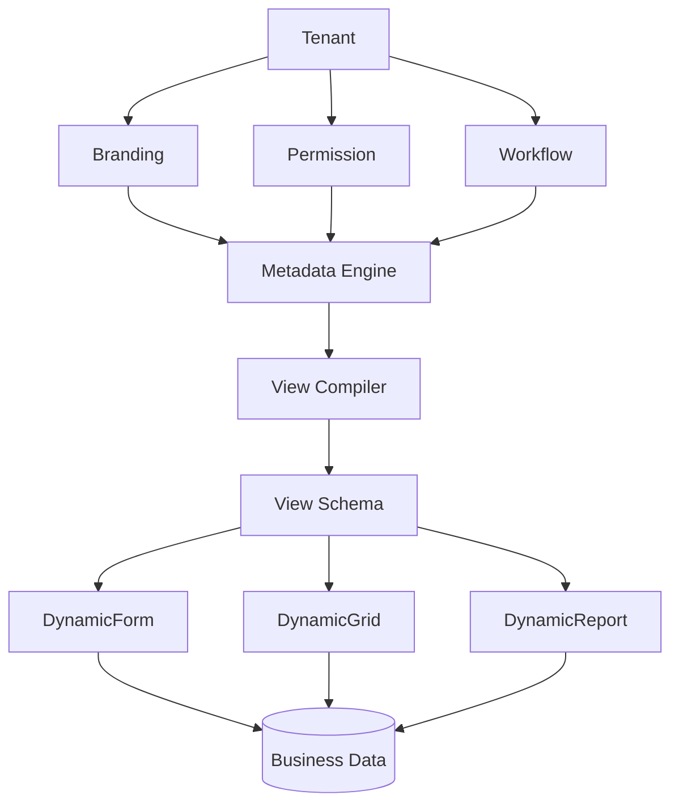

# Kiến Trúc Hệ Thống (Platform Architecture)

Nếu mục tiêu của bạn là xây dựng một nền tảng (Platform) chứ không phải một ứng dụng CRUD thông thường, kiến trúc dưới đây được thiết kế để tối ưu hóa khả năng mở rộng, tùy biến và tái sử dụng.

---

## 1. Kiến Trúc Tổng Thể (Overall Architecture)

```text
                         Browser
                            │
                            ▼
                    React + Vite + TS
                            │
                    Runtime UI Engine
                            │
      ┌──────────────┬──────┴───────┬──────────────┐
      │              │              │              │
      ▼              ▼              ▼              ▼
 DynamicForm    DynamicGrid    DynamicView   DynamicReport
      │              │              │              │
      └──────────────┼──────────────┴──────────────┘
                     │
             GET /views/orders
                     │
 ──────────────────── API ────────────────────
                     │
             NestJS Application
                     │
 ┌───────────────────┼────────────────────┐
 │                   │                    │
 ▼                   ▼                    ▼
Auth Engine   Metadata Engine        File Engine
 │                   │                    │
 ▼                   ▼                    ▼
Permission     View Compiler        Upload/Move
 │                   │              Copy/Rename
 ▼                   ▼                    ▼
Workflow        View Schema          ONLYOFFICE
 │                   │
 ▼                   ▼
Query Engine    Cache (Redis)
 │
 ▼
PostgreSQL
```

---

## 2. Phân Chia Cơ Sở Dữ Liệu (Database Segmentation)

Để đảm bảo tính độc lập và hiệu năng, dữ liệu được chia làm 3 phân vùng logic chính. **Nguyên tắc cốt lõi: Không để metadata lẫn lộn với dữ liệu nghiệp vụ (business).**

### Dữ Liệu Nghiệp Vụ (`business/`)
Lưu trữ thông tin giao dịch và dữ liệu hoạt động của doanh nghiệp:
* `customers`: Thông tin khách hàng.
* `products`: Thông tin sản phẩm.
* `orders`: Đơn hàng.
* `order_details`: Chi tiết đơn hàng.
* `folders` & `files`: Cấu trúc thư mục và tập tin của người dùng.

### Dữ Liệu Cấu Hợp Nền Tảng (`metadata/`)
Định nghĩa cấu trúc, giao diện và luồng xử lý của hệ thống:
* `tenants`: Quản lý các khách hàng thuê hệ thống (Multi-tenant).
* `system_tables` & `system_fields`: Định nghĩa schema động.
* `system_views` & `system_layouts`: Định nghĩa giao diện hiển thị.
* `system_relations`: Các mối quan hệ dữ liệu.
* `system_validations`: Quy tắc kiểm tra dữ liệu.
* `system_permissions`: Phân quyền động.
* `system_workflows`: Luồng phê duyệt/xử lý.
* `system_actions` & `system_expressions`: Hành động và biểu thức tính toán.
* `system_filters`: Bộ lọc dữ liệu.
* `system_plugins`: Tiện ích mở rộng.

### Dữ Liệu Hệ Thống (`system/`)
Quản lý vận hành và bảo mật:
* `users` & `roles`: Tài khoản và vai trò.
* `permissions`: Quyền hệ thống tĩnh.
* `audit_logs`: Nhật ký vận hành phục vụ giám sát và bảo mật.
* `notifications`: Thông báo hệ thống.

---

## 3. Cấu Trúc Thư Mục Dự Án (Project Structure)

### Backend (NestJS)

```text
backend/src/
├── app.module.ts
├── main.ts
├── common/             # Các thành phần dùng chung toàn hệ thống
│   ├── decorators/
│   ├── guards/
│   ├── filters/
│   ├── interceptors/
│   ├── utils/
│   └── constants/
├── config/             # Cấu hình môi trường và ứng dụng
├── database/           # Kết nối DB và cấu hình Prisma
├── core/               # Các dịch vụ cốt lõi của hệ thống
│   ├── auth/           # Xác thực & Phân quyền cơ bản
│   ├── users/          # Quản lý người dùng
│   ├── roles/          # Quản lý vai trò
│   ├── tenants/        # Quản lý đa thuê (Multi-tenant)
│   ├── audit/          # Lưu audit log
│   └── notification/   # Quản lý và gửi thông báo
├── engines/            # Các công cụ xử lý động (Trái tim của Platform)
│   ├── metadata/       # Đọc/ghi cấu trúc dữ liệu động (metadata.service/repository)
│   ├── view/           # Biên dịch layout và schema giao diện (compiler, schema, cache)
│   ├── query/          # Xây dựng câu truy vấn động (builder, filter, join, sort, paging)
│   ├── validation/     # Kiểm tra tính hợp lệ dữ liệu động
│   ├── workflow/       # Công cụ chạy quy trình tự động
│   ├── permission/     # Phân quyền động mức dòng/cột
│   ├── expression/     # Đánh giá biểu thức logic động
│   ├── lookup/         # Truy vấn dữ liệu liên kết động
│   └── file/           # Xử lý file (upload, move, rename, preview)
├── modules/            # Các nghiệp vụ tĩnh hoặc nghiệp vụ cơ bản
│   ├── customers/
│   ├── products/
│   ├── orders/
│   ├── documents/
│   └── dashboard/
└── integrations/       # Tích hợp dịch vụ bên ngoài
    ├── minio/          # S3 storage
    ├── onlyoffice/     # Trình soạn thảo văn bản trực tuyến
    ├── rabbitmq/       # Hàng đợi tin nhắn (Queue)
    └── email/          # Dịch vụ gửi Email
```

### Frontend (React + Vite + TS)

```text
frontend/src/
├── main.tsx
├── vite-env.d.ts
├── app/                # Cấu hình providers, routing và theme
├── assets/             # Hình ảnh, font chữ tĩnh
├── styles/             # CSS & design system tokens
├── store/              # Zustand UI state
├── hooks/              # TanStack Query & API hooks
├── services/           # Axios API Client
├── i18n/               # Tài nguyên đa ngôn ngữ (EN/VI)
├── components/         # Các thành phần giao diện tái sử dụng
│   ├── dynamic/        # UI tự động render từ Metadata Schema
│   │   ├── ComponentFactory/   # Quyết định render control nào
│   │   ├── DynamicPage/        # Trang động tổng thể
│   │   ├── DynamicForm/        # Form nhập liệu động
│   │   ├── DynamicGrid/        # Bảng dữ liệu động
│   │   ├── DynamicFilter/      # Bộ lọc tìm kiếm động
│   │   ├── DynamicLookup/      # Ô chọn liên kết động
│   │   ├── DynamicTabs/        # Tab động
│   │   ├── DynamicSection/     # Section động
│   │   └── DynamicToolbar/     # Thanh công cụ động
│   └── file/           # Giao diện quản lý file tĩnh (Không dùng Schema động)
│       ├── Explorer/           # Trình quản lý file dạng lưới/danh sách
│       ├── FolderTree/         # Cây thư mục bên trái
│       ├── Breadcrumb/         # Đường dẫn thư mục
│       ├── Upload/             # Hộp thoại upload progress
│       ├── ContextMenu/        # Menu chuột phải
│       ├── Preview/            # Trình xem trước tài liệu
│       └── OnlyOffice/         # Khung soạn thảo văn bản
└── pages/              # Các trang giao diện theo router
    ├── admin/          # Trang quản trị (users, audit)
    ├── customers/
    ├── orders/
    ├── documents/
    └── dashboard/
```

---

## 4. Phân Biệt Cơ Chế Render: Dynamic vs Static

Không phải mọi chức năng đều nên động hóa (dynamic). Việc cân bằng giữa Dynamic (linh hoạt, cấu hình được) và Static (hiệu năng cao, dễ code) là rất quan trọng.

| Loại giao diện / Chức năng | Cơ chế (Dynamic) | Cơ chế (Static) | Lý do thiết kế |
| :--- | :---: | :---: | :--- |
| **Form** (Nhập liệu) | ✔ | | Biểu mẫu thay đổi theo nghiệp vụ của từng khách hàng. |
| **Grid** (Bảng dữ liệu) | ✔ | | Các cột hiển thị cần ẩn/hiện và lọc theo cấu hình. |
| **Filter** (Bộ lọc) | ✔ | | Cần tự động sinh bộ lọc dựa trên các trường dữ liệu động. |
| **Lookup** (Chọn liên kết) | ✔ | | Tự động lấy danh sách và hiển thị theo quan hệ metadata. |
| **Search & Validation** | ✔ | | Ràng buộc dữ liệu phải linh hoạt theo từng Tenant. |
| **Permission & Workflow** | ✔ | | Phân quyền và luồng duyệt cấu hình trực tiếp trên UI. |
| **Dashboard / Report** | ✔ | | Khách hàng tự thiết kế widget và báo cáo. |
| **File Explorer & Tree** | | ✘ | Cấu trúc cây thư mục phức tạp, cần code cứng để tối ưu UX/UI. |
| **Upload / Drag & Drop** | | ✘ | Tương tác kéo thả phức tạp, không cần cấu hình động. |
| **OnlyOffice Editor** | | ✘ | Tích hợp sâu thư viện bên thứ ba, cần tối ưu hiệu năng. |
| **ContextMenu / Viewers** | | ✘ | Menu ngữ cảnh và các trình xem file (PDF, Image, Video) nên code cứng. |

---

## 5. Quy Trình Xử Xử Lý Yêu Cầu (Request & Render Flow)

Khi người dùng truy cập một trang động, ví dụ: `GET /views/orders`.

```mermaid
sequenceDiagram
    autonumber
    actor Browser as Trình duyệt (React)
    participant API as Backend (NestJS)
    participant ME as Metadata Engine
    participant PE as Permission Engine
    participant VC as View Compiler
    participant Cache as Redis Cache
    database DB as PostgreSQL

    Browser->>API: GET /api/views/orders (Kèm Tenant ID)
    API->>ME: Lấy định nghĩa thực thể (Entity Metadata)
    ME->>DB: Query system_tables & fields
    DB-->>ME: Metadata thô
    API->>PE: Kiểm tra phân quyền truy cập cột/dòng
    PE-->>API: Danh sách cột được phép xem
    API->>VC: Trộn Metadata với Phân quyền & Workflow
    VC->>Cache: Kiểm tra xem Schema đã có trong Cache chưa
    alt Cache Miss
        VC->>VC: Biên dịch thành JSON Schema hoàn chỉnh
        VC->>Cache: Lưu JSON Schema vào Redis
    else Cache Hit
        Cache-->>VC: Lấy JSON Schema từ Redis
    end
    VC-->>API: JSON Schema cuối cùng
    API-->>Browser: Trả về JSON Schema (200 OK)
    Note over Browser: React UI Engine nhận Schema<br/>Tự động vẽ giao diện:<br/>&lt;DynamicPage schema={schema} /&gt;<br/>(Không cần code sẵn OrderForm hay OrderGrid)
```

---

## 6. Cấu Trúc Giao Diện Một Màn Hình (Screen Layout Structure)

Khi React tự động render một màn hình động dựa trên `ViewSchema`, nó sẽ dựng toàn bộ các component con theo luồng từ trên xuống dưới mà không cần code cứng giao diện:



---

## 7. Cơ Chế Đa Thuê (Multi-Tenant UI Customization)

Mỗi Tenant (khách hàng doanh nghiệp) có thể tùy biến giao diện và quy trình riêng mà không cần deploy lại ứng dụng.



* **Không cần Deploy lại:** Khi doanh nghiệp thay đổi cấu hình trường dữ liệu hay quy trình phê duyệt, hệ thống chỉ cập nhật database metadata và xóa cache Redis. Trình duyệt tải lại sẽ tự động áp dụng giao diện mới.

---

## 8. Kiến Trúc Luồng Dữ Liệu Cuối Cùng (End-to-End Flow Architecture)



---

## 9. Định Hướng Phát Triển Nền Tảng (Long-term Platform Roadmap)

Đối với một sản phẩm định hướng phát triển từ 5 - 10 năm, hệ thống được thiết kế theo hướng **Engine-based** thay vì **Module-based**. Các nghiệp vụ cụ thể sẽ chỉ đóng vai trò là các plugin cắm vào lõi.

```text
Platform (Lõi Nền Tảng)
├── Auth Engine (Xác thực)
├── Tenant Engine (Đa thuê)
├── Metadata Engine (Định nghĩa dữ liệu)
├── View Engine (Sinh giao diện)
├── Query Engine (Truy vấn động)
├── Permission Engine (Phân quyền)
├── Validation Engine (Kiểm tra dữ liệu)
├── Workflow Engine (Luồng xử lý)
├── Expression Engine (Tính toán biểu thức)
├── File Engine (Quản lý tập tin)
├── Search Engine (Tìm kiếm nâng cao)
├── Report Engine (Báo cáo thống kê)
├── Notification Engine (Thông báo)
├── Plugin Engine (Quản lý mở rộng)
├── AI Engine (Trợ lý & RAG)
└── Integration Engine (Kết nối bên ngoài)
```

Sau khi hoàn thiện các Engine trên, các module nghiệp vụ lớn chỉ cần khai báo Metadata cấu hình và cắm vào dưới dạng các Plugin:

```text
┌─────────────┐   ┌─────────────┐   ┌─────────────┐   ┌─────────────┐
│ CRM Plugin  │   │ HRM Plugin  │   │ DMS Plugin  │   │ ERP Plugin  │
└──────┬──────┘   └──────┬──────┘   └──────┬──────┘   └──────┬──────┘
       │                 │                 │                 │
       └─────────────────┴────────┬────────┴─────────────────┘
                                  ▼
                     Platform Core (Các Engines)
```

### Sự khác biệt cốt lõi:
* **Ứng dụng thường (Application):** Với mỗi dự án mới, lập trình viên phải viết lại `CustomerService`, `OrderService`, `ProductService`, thiết kế lại UI Form/Grid thủ công.
* **Nền tảng (Platform):** Viết Engine một lần duy nhất. Khi thêm một phân hệ mới (ví dụ Quản lý kho), bạn **không cần viết lại giao diện, phân quyền hay workflow** từ đầu, mà chỉ cần cấu hình metadata và bổ sung logic nghiệp vụ đặc thù (custom business logic) ở những chỗ cần thiết.
